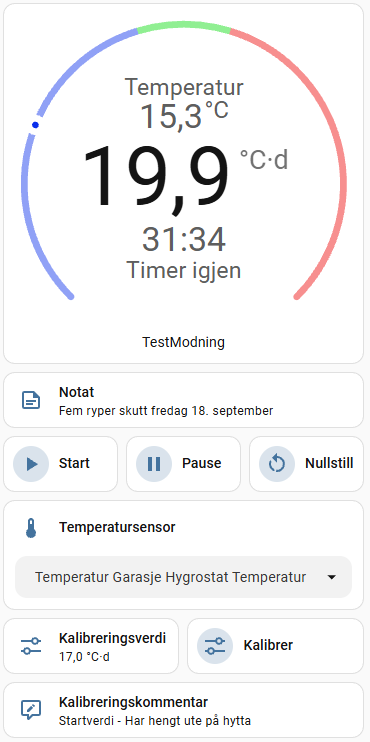

[](https://github.com/eirikman/modningsteller/actions/workflows/hassfest.yml)
[](https://github.com/eirikman/modningsteller/actions/workflows/tests.yml)

# Modningsteller



A Home Assistant custom integration for tracking the maturation of game meat using degree days and temperature history.

Modningsteller is designed for meat maturation where accumulated temperature exposure is used as an indicator of maturation progress. Each maturation process is independent and can use its own temperature sensor, target value and update interval.

> **Status:** Personal project / public beta

> The integration is currently developed primarily for personal use.
> It is shared publicly for testing and feedback.
> HACS publication may be considered at a later stage.

## Features

- Multiple independent maturation counters
- Configurable starting degree-day value
- Configurable target value
- Selectable temperature sensor
- Change temperature sensor while a process is running
- Rolling one-hour average temperature
- Configurable calculation interval
- Configurable temperature sensor health timeout per maturation counter
- Start, pause and reset controls
- Explicit process states:
  - Ready
  - Running
  - Paused
  - Target reached
- Pressing Start while already running has no effect
- Degree-day accumulation continues after the target is reached
- Notification when the target is reached
- Estimated finish time
- Elapsed active time
- Remaining degree days
- Timestamp for when the target was reached
- Temperature sensor health monitoring
- Detection of stale or unavailable temperature data
- Continued accumulation using the last known temperature when the selected sensor is stale or unavailable
- Calibration of accumulated degree days during an ongoing process
- Calibration comments and history
- Notes for the maturation process
- History of important events
- Persistent state across Home Assistant restarts
- Norwegian and English translations
- Integration branding with a ptarmigan icon
- Optional Lovelace dashboard template

## How it works

The integration accumulates degree days based on the rolling average temperature from the selected temperature sensor.

The degree-day calculation depends on the temperature:

- **At or above 4 °C:**
  
      degree days += average temperature × elapsed time in days

- **Between 0 °C and 4 °C:**
  
      degree days += (40 / (40 - 7.5 × average temperature)) × elapsed time in days

- **Below 0 °C:**
  
      No degree days are accumulated.

This means that temperatures below 4 °C contribute to the maturation process at a reduced, non-linear rate, while temperatures below 0 °C are currently considered to stop the maturation process completely.

The temperature average is calculated over the most recent hour.

The calculation interval is configurable. The default interval is 10 minutes.

The target value is a notification threshold, not a stopping point. When the target is reached:

1. The target is marked as reached.
2. A notification/event is generated.
3. The counter continues accumulating degree days.

This makes it possible to see the actual degree-day value when the meat is eventually removed.

## Installation

### Manual installation

Copy the integration directory into your Home Assistant configuration directory:

    /config/custom_components/modningsteller/

The resulting structure should be:

    /config
    └── custom_components
        └── modningsteller
            ├── __init__.py
            ├── button.py
            ├── config_flow.py
            ├── const.py
            ├── coordinator.py
            ├── manifest.json
            ├── number.py
            ├── select.py
            ├── sensor.py
            ├── text.py
            ├── brand
            │   └── icon.png
            └── translations
                ├── en.json
                └── nb.json

Restart Home Assistant after installation.

The integration can then be added from:

**Settings → Devices & services → Add integration**

Search for:

**Modningsteller**

## Configuration

Each maturation process is configured independently.

Typical configuration options include:

- Name
- Temperature sensor
- Initial degree-day value
- Target degree-day value
- Calculation interval
- Temperature sensor health timeout

### Temperature sensor

The temperature sensor can be changed while a process is running.

When the sensor is changed:

- accumulated degree days are preserved
- process timing is preserved
- the new sensor is used from the time of the change
- temperature averaging starts using the new sensor so that historical data from different sensors is not mixed

### Temperature sensor health timeout

Each maturation counter has its own configurable stale-temperature timeout.

The timeout determines how long the integration will wait for a new temperature value before the selected sensor is considered stale.

The setting can be changed after the maturation counter has been created.

During Home Assistant startup, the sensor health may temporarily be reported as Unknown until the selected temperature sensor becomes available.

This is particularly useful for battery-powered Zigbee temperature sensors, which may report relatively infrequently.

## Process controls

### Start

Starts a ready or paused maturation process.

Pressing Start while the process is already running has no effect.

### Pause

Stops degree-day accumulation and active-time counting while preserving the current process state and accumulated value.

### Reset

Resets the active maturation process to its configured initial state and places it in the **Ready** state.

Reset performs the following:

- restores the configured initial degree-day value
- clears the active calibration value
- clears the active calibration comment
- clears the active maturation note
- clears the current start time
- clears active elapsed time
- clears the target-reached state
- does not automatically start a new process

Historical calibration, note and event information is preserved.

After a reset, the counter is **Ready for a new maturation process**. A new start time is created when Start is pressed.

## Calibration

Degree days can be adjusted during an ongoing process.

Calibration does not reset:

- Start time
- Elapsed active time
- Temperature sensor
- Process history

Calibration events are recorded together with the previous value, new value, timestamp and optional comment.

This is useful when part of the maturation process took place before the process was added to Home Assistant, or when an external measurement indicates that the accumulated value should be corrected.

## Notes

Each maturation process can have an associated note.

Notes can be used for information such as:

- Type of game
- Cut of meat
- Location
- Refrigerator changes
- Other observations

The current note can be cleared by resetting the maturation process.

Historical note information is preserved as part of the process history.

Notes are stored persistently and survive Home Assistant restarts.

## Temperature sensor health

The integration monitors the selected temperature sensor.

The sensor health state can indicate conditions such as:

- OK
- Stale
- Unavailable
- Unknown

Each maturation counter has its own configurable stale-data timeout.

### Stale temperature data

If the selected temperature sensor has not provided a new valid value within the configured timeout, the sensor is considered **Stale**.

The integration continues accumulating degree days using the **last known valid temperature**.

A sensor-health notification/event is generated when the sensor becomes stale while the counter is active. When the counter is **Ready** after a reset, sensor health continues to update, but no sensor-health notification is sent.

### Unavailable temperature data

If the selected temperature entity becomes unavailable but a previous valid temperature is available, the integration continues using the last known valid temperature.

A sensor-health notification/event is generated when the sensor becomes unavailable while the counter is active. When the counter is **Ready** after a reset, sensor health continues to update, but no sensor-health notification is sent.

When a new valid temperature becomes available, normal temperature processing resumes.

If no valid temperature has ever been received, degree-day accumulation cannot begin until a valid temperature is available.

## Sensors

Depending on configuration and process state, a maturation counter provides entities such as:

- Degree days
- Remaining degree days
- One-hour average temperature
- Elapsed time
- Start time
- Estimated finish time
- Target reached
- Status
- Temperature sensor health
- Last valid temperature reading
- Last event

Additional control/configuration entities are provided for:

- Start
- Pause
- Reset
- Calibration
- Notes
- Temperature sensor selection
- Temperature sensor health timeout

## Events

The integration emits a custom Home Assistant event for important process changes.

**Event type:** `modningsteller_event`

The event contains a `type` field identifying the event:

- `started`
- `paused`
- `reset`
- `calibrated`
- `temperature_sensor_changed`
- `target_reached`
- `sensor_health_changed`
- `note_added`
- `note_cleared`

These events can be used in Home Assistant automations.

For example, to trigger an automation that sends a notification to your phone when any Modningsteller counter reaches its target:

```yaml
alias: Modningsteller - Target Reached
description: Send a phone notification when any Modningsteller counter reaches its target
triggers:
  - trigger: event
    event_type: modningsteller_event
    event_data:
      type: target_reached

actions:
  - action: notify.mobile_app_your_phone
    data:
      title: "Modningsteller - Target Reached"
      message: >-
        {{ trigger.event.data.name }} has reached its target.

        Finished: {{ as_local(as_datetime(trigger.event.data.timestamp)).strftime('%d.%m.%Y at %H:%M') }}

        Degree-days: {{ trigger.event.data.degree_days }} °C·d
        Target: {{ trigger.event.data.target_degree_days }} °C·d

mode: parallel
```

The event also contains information about the counter, including its name, timestamp, degree-days and target value.

`modningsteller_event` is the Home Assistant **event type**. The **type field** in the event data identifies what happened.

## Dashboard

Optional Lovelace dashboard templates are included in:

    dashboard/modningsteller_decluttering.yaml

The template is intended for use with the [Decluttering Card](https://github.com/custom-cards/decluttering-card).

Example:

```yaml
type: custom:decluttering-card
template: modningsteller_kontroll
variables:
  - id: rype
```

The `id` must match the entity ID prefix generated by your Modningsteller instance.

For example:

```yaml
type: custom:decluttering-card
template: modningsteller_kontroll
variables:
  - id: hjortelar
```

The dashboard templates are optional. The integration itself does not depend on them.

## Development

The project repository is structured as follows:

```text
custom_components/modningsteller/
    Home Assistant integration

dashboard/
    Optional Lovelace dashboard templates

tests/
    Automated integration tests
```

Future development uses Git for version control and GitHub releases for versioned builds.

The repository uses GitHub Actions for automated validation:

- Hassfest
- Pytest

## Versioning

The project uses semantic versioning:

- `MAJOR` - breaking changes
- `MINOR` - new functionality
- `PATCH` - bug fixes and small improvements

Example:

```text
v1.0.1
v1.0.2
v1.1.0
```

## Requirements

The integration is developed for modern Home Assistant versions and is currently tested against the Home Assistant version used by the developer.

## License

Modningsteller is licensed under the [MIT License](LICENSE).

## Disclaimer

This integration is a personal Home Assistant project.

Degree-day calculations are provided as an aid for monitoring a maturation process and should not be considered a substitute for appropriate food-safety practices, temperature control or professional guidance.